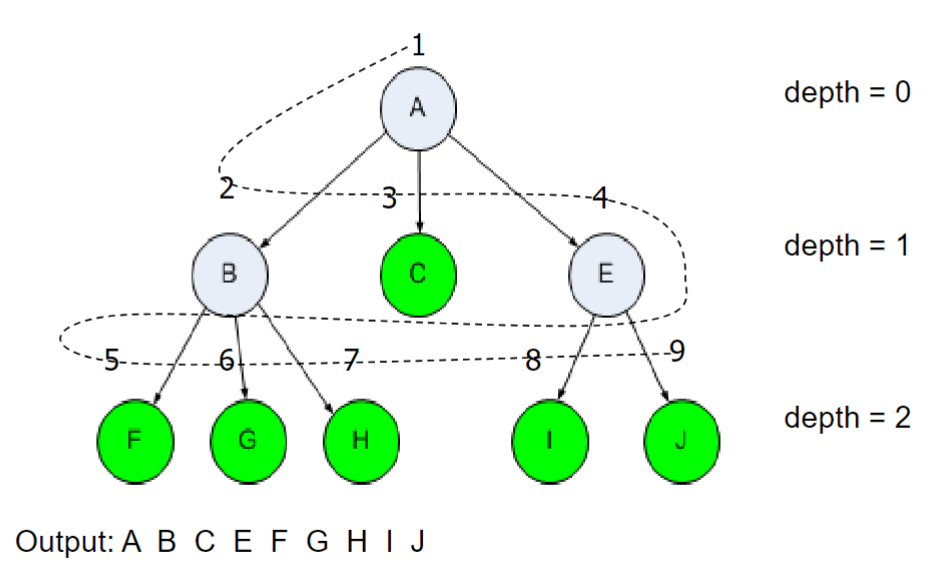
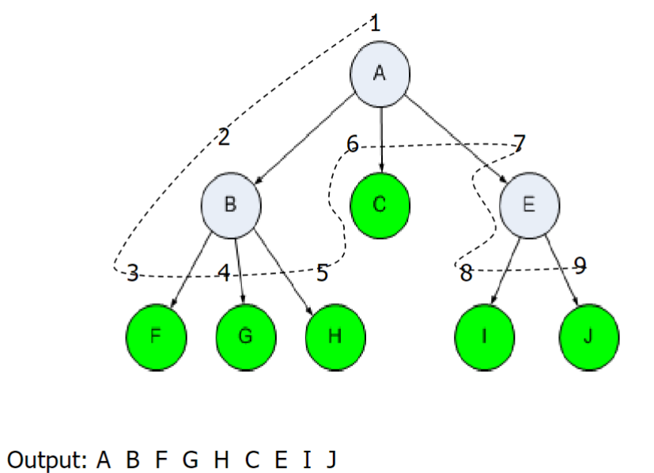

<!-- 
_backgroundImage: url('backgrounds/Title.PNG')
_class: title
 -->

# Tutorial 6: Trees and Algorithms

**CAB301 - Algorithms and Complexity**

School of Computer Science, Faculty of Science

---
<!-- 
footer: '**CAB301 - Algorithms and Complexity**<br>School of Computer Science, Faculty of Science'
-->

# Tree

A **tree** is a collection of nodes connected by directed edges.

<div class="flexbox">

<div style="flex: 0.5">

Various implementations, but in CAB301, each node:

- Has a piece of data (`Key`)
- Reference to its `FirstChild`
- Reference to its `FirstSibling`

</div>

<div style="flex: 0.5">

```csharp
public class Node
{
    public int Key;
    public Node FirstChild;
    public Node FirstSibling;
}
```

</div>

</div>


---

# Breath First Traversal

Visit all nodes at a given depth before moving to the next depth. Use a `Queue` to store sibling nodes. Nearer siblings (first in) are visited first (first out).

<div class="flexbox">

<small style="font-size: 22px; flex: 0.5">

**ALGORITHM** $BreadthFirstTraversal(root)$
$q \leftarrow \emptyset$ // Empty queue
$q.\text{enqueue}(root)$
**while** $q \neq \emptyset$ **do**
$\quad\quad r \leftarrow q.\text{dequeue}()$
$\quad\quad \text{visit}~r$
$\quad\quad r \leftarrow r.\text{FirstChild}$
$\quad\quad$ **while** $~r \neq \text{null}$ **do**
$\quad\quad\quad\quad q.\text{enqueue}(r)$
$\quad\quad\quad\quad r \leftarrow r.\text{FirstSibling}$

</small>

<div style="flex: 0.5">



</div>

</div>

---

# Depth First Traversal

Visit all nodes in a branch before moving to the next branch. Use a `Stack` to store sibling nodes. Deeper siblings (last in) are visited first (first out).

<div class="flexbox">

<small style="font-size: 22px; flex: 0.5">

**ALGORITHM** $DepthFirstTraversal(root)$
$s \leftarrow \emptyset$ // Empty stack
$s.\text{push}(root)$
**while** $s \neq \emptyset$ **do**
$\quad\quad r \leftarrow s.\text{pop}()$
$\quad\quad$ **while** $~r \neq \text{null}$ **do**
$\quad\quad\quad\quad\text{visit}~r$
$\quad\quad\quad\quad$**if** $r.\text{FirstSibling} \neq \text{null}$
$\quad\quad\quad\quad\quad\quad s.\text{push}(r.\text{FirstSibling})$
$\quad\quad\quad\quad r \leftarrow r.\text{FirstChild}$

</small>

<div style="flex: 0.45">



</div>

</div>