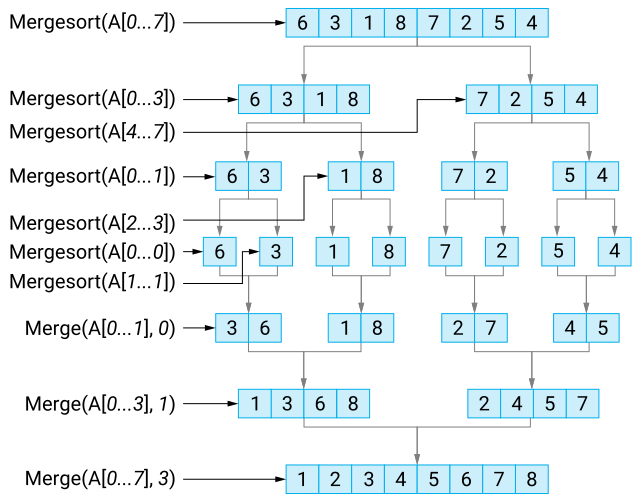
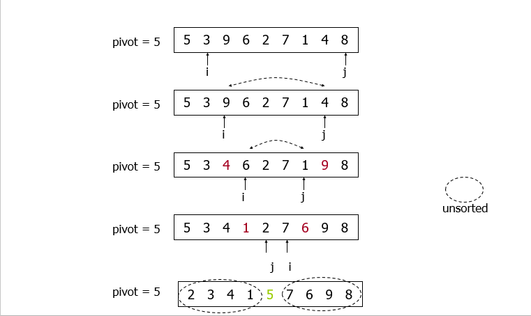
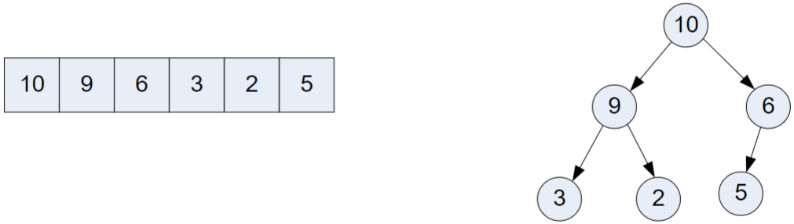
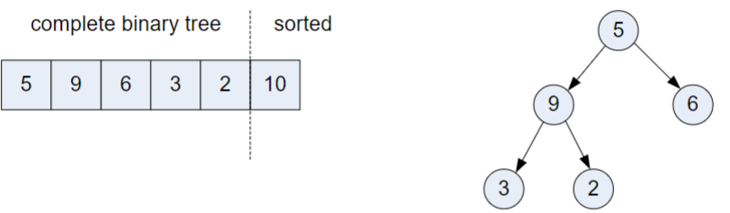
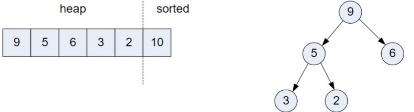

<!-- 
_backgroundImage: url('backgrounds/Title.PNG')
_class: title
 -->

# Tutorial 7: Advanced Sorting Algorithms

**CAB301 - Algorithms and Complexity**

School of Computer Science, Faculty of Science

---
<!-- 
footer: '**CAB301 - Algorithms and Complexity** School of Computer Science, Faculty of Science'
-->

# Agenda

1. **Lecture Recap**: Advanced Sorting Algorithms
   - Merge Sort
   - Quick Sort
   - Heap Sort
2. **Tutorial Questions** + **Q&A**

---

# Merge Sort

**Divide and Conquer** algorithm, relies on a **merge** operation:
- How to combine two sorted arrays into a single sorted array?

**ALGORITHM** $MergeSort(A[i..j])$
$\quad$$\quad$**if** $i < j$
$\quad$$\quad$$\quad$$\quad$$m ← \lfloor(i + j)/2\rfloor$
$\quad$$\quad$$\quad$$\quad$$MergeSort(A[i..m])$
$\quad$$\quad$$\quad$$\quad$$MergeSort(A[m + 1..j])$
$\quad$$\quad$$\quad$$\quad$$Merge(A[i..j], m)$

---

# Quick Sort

**Divide and Conquer** algorithm, relies on a **partition** operation that, given a pivot, divides the array into two parts:
- Left part contains elements less than the pivot, and right part greater.

**ALGORITHM** $QuickSort(A[l..r])$
$\quad$$\quad$**if** $l < r$
$\quad$$\quad$$\quad$$\quad$$s ← Partition(A[l..r])$
$\quad$$\quad$$\quad$$\quad$$QuickSort(A[l..s - 1])$
$\quad$$\quad$$\quad$$\quad$$QuickSort(A[s + 1..r])$

**Partitioning process**

Here, the split position is $s = 4$.

---

# Heap Sort

**Heap Sort** keeps the array as a **max-heap**:
- Complete binary tree
- Each node is no less than its children.

Repeatedly perform **Maximum Key Deletion**:

1. Exchange the root's key with the last key.
2. Decrease the heap size by 1.
3. **Heapify** the complete binary tree.

