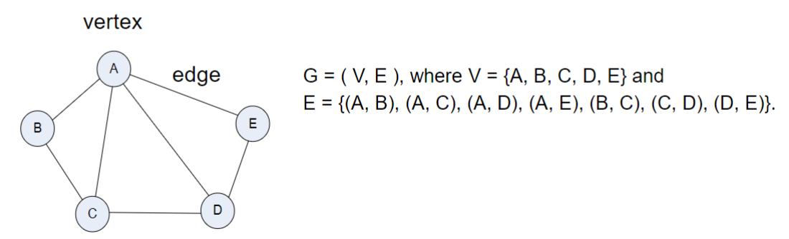

<!-- 
_backgroundImage: url('backgrounds/Title.PNG')
_class: title
 -->

# Tutorial 8: Graph Algorithms I

**CAB301 - Algorithms and Complexity**

School of Computer Science, Faculty of Science

---
<!-- 
footer: '**CAB301 - Algorithms and Complexity** School of Computer Science, Faculty of Science'
-->

# Agenda

1. **Lecture Recap**: Graph Algorithms I
   - Graphs
   - Graph Representations
   - Graph Traversals
   - Topological Sort
   - Spanning Tree
2. **Tutorial Questions** + **Q&A**

---

# Graphs

A collection of nodes (**vertices**) and **edges** connecting them.

---

# Directionality and Weight

Graphs can be **directed**, where edges have a direction, or **undirected**.

Graphs can be **weighted**, where edges have a weight, or **unweighted**.

---

# Terminology

- **Path**: A sequence of vertices connected by edges.
- **Cycle**: A path that starts and ends at the **same vertex**.
- **Connected**: A graph where there is a path between every pair of vertices.
- **Subgraph**: A graph whose vertices and edges are a subset of another graph.

---

# Graph Representations - Adjacency Matrix

2D array, $A$, where $A[i][j] = w$ if there is an edge from $i$ to $j$ with weight $w$, or $\infty$ if there is no edge. 

If unweighted, $A[i][j] = 1$ if there is an edge, or $0$ if there is no edge.

---

# Graph Representations - Adjacency List

For each vertex, $i$, store a list of vertices that $i$ is connected to.

---

# Graph Traversals

**Depth-First Search (DFS)**: Explore **as far as possible** along each branch before backtracking.

- Uses either a **stack** or **recursion**.

**Breadth-First Search (BFS)**: Explore **all neighbours of a vertex before moving** to the next level.

- Uses a **queue**.

Very similar to tree traversals, but need to keep track of visited vertices (and not visit them again).

---

# Topological Sort

Given a **directed acyclic graph (DAG)**, order the vertices such that for every edge $(u, v)$, $u$ comes before $v$. Steps:

1. Find a vertex with **no incoming edges** (in-degree = 0).
2. Add it to the **topological order**.
3. **Remove** the vertex and its outgoing edges.
4. **Repeat** until all vertices are ordered.

---

# Spanning Tree

A **subgraph** of a graph that is a **tree** and connects all vertices.

Weighted graphs can have a **minimum spanning tree (MST)**, which is a spanning tree with the **minimum total weight**.

Minimum Spanning Tree of a weighted graph.

---

# Kruskal's Algorithm

1. **Sort** edges by weight in **non-decreasing order**.
2. **Iterate** through edges:
   - **Add** edge to MST if it **does not create a cycle**.
   - **Repeat** until $|V| - 1$ edges are added.
3. **Output** the MST.

---

# Prim's Algorithm

Keep track a set of vertices in the MST, $V_T$ and a set of edges in the MST, $E_T$. Starting with $V_T = \{v_0\}$ and $E_T = \emptyset$, repeat for $|V| - 1$ times:

1. Find a **minimum weight edge** $e^* =(v^*, u^*)$ among edges connecting $V_T$ to the rest of the graph.
2. **Add** $u^*$ to $V_T$.
3. **Add** $e^*$ to $E_T$.

