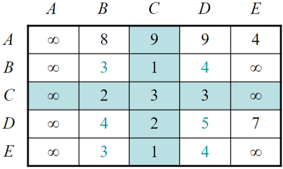

<!-- 
_backgroundImage: url('backgrounds/Title.PNG')
_class: title
 -->

# Tutorial 9: Graph Algorithms II

**CAB301 - Algorithms and Complexity**

School of Computer Science, Faculty of Science

---
<!-- 
footer: '**CAB301 - Algorithms and Complexity** School of Computer Science, Faculty of Science'
-->

# Agenda

1. **Lecture Recap**: Graph Algorithms II
   - Shortest Path Problem
   - Dijkstra's Algorithm
   - Floyd's Algorithm

2. **Tutorial Questions** + **Q&A**

---

# The Shortest Path Problem

**What's the shortest path from A to B?**

It's actually A → E → C → B, with a total weight of 6 units, instead of A → B with a total weight of 8 units.

---

# Dijkstra's Algorithm

<small>

Find the shortest path from a **start node to all other nodes** in a weighted graph, by 1) visit nearest node, and 2) update the distances of unvisited nodes, via the selected node.

</small>

<small>

**Example**: In step 2, we select $E$ as the nearest node from $A$, and for each vertex not yet visited (i.e., $B,C,D$), we compare the current shortest path with the path through $E$.

</small>

---

# Floyd's Algorithm

<small>

Find the shortest path between **all pairs of nodes** in a weighted graph, by 1) consider all nodes as **intermediate nodes**, and 2) update the shortest path if a shorter path is found.

</small>

Start with adjacency matrix.

Update each cell, via $A$ (add row + column, and replace if smaller).

Result (shortest path between all pairs)

